# Database-Based Sync Implementation Guide

## Overview

This document explains the new database-based sync tracking implementation that replaced the file-based `last_sync.txt` approach. The new system provides persistent sync state management, comprehensive audit trails, and robust error handling across container restarts.

## Architecture Changes

### Previous Implementation (File-Based)
- ❌ Single `last_sync.txt` file storing timestamp
- ❌ Lost on container restart without volumes
- ❌ No error tracking or audit trail
- ❌ Single sync type tracking
- ❌ Race conditions with concurrent processes

### New Implementation (Database-Based)
- ✅ Two dedicated database tables for sync tracking
- ✅ Persistent across container restarts
- ✅ Complete audit trail with error tracking
- ✅ Multiple sync types tracked independently
- ✅ Thread-safe operations with database transactions

## New Database Tables

### 1. `odk_sync_status` - Current Status Tracking

```sql
CREATE TABLE odk_sync_status (
    sync_type VARCHAR(50) PRIMARY KEY,           -- 'main_submissions', 'person_details', etc.
    last_sync_timestamp TIMESTAMP WITH TIME ZONE, -- Last successful sync
    last_attempt_timestamp TIMESTAMP WITH TIME ZONE, -- Last attempt (success/failure)
    last_sync_status VARCHAR(20) DEFAULT 'pending', -- 'success', 'error', 'in_progress'
    last_error_message TEXT,                     -- Error details if failed
    successful_sync_count INTEGER DEFAULT 0,     -- Total successful syncs
    failed_sync_count INTEGER DEFAULT 0,         -- Total failed syncs
    last_records_processed INTEGER,              -- Records in last successful sync
    created_at TIMESTAMP WITH TIME ZONE DEFAULT NOW(),
    updated_at TIMESTAMP WITH TIME ZONE DEFAULT NOW()
);
```

**Purpose**: Maintains current sync status for each sync type with comprehensive metrics.

### 2. `odk_sync_history` - Complete Audit Trail

```sql
CREATE TABLE odk_sync_history (
    id SERIAL PRIMARY KEY,
    sync_type VARCHAR(50) NOT NULL,              -- Type of sync operation
    sync_timestamp TIMESTAMP WITH TIME ZONE DEFAULT NOW(), -- When sync started
    status VARCHAR(20) NOT NULL,                 -- 'success', 'error', 'in_progress'
    records_processed INTEGER,                   -- Number of records processed
    duration_seconds INTEGER,                    -- How long sync took
    error_message TEXT,                          -- Error details if failed
    sync_metadata TEXT,                          -- Additional JSON metadata
    service_instance VARCHAR(100)                -- Which service instance ran sync
);
```

**Purpose**: Complete historical record of all sync attempts for monitoring and debugging.

## Sync Types Tracked

The system now tracks four distinct sync operations:

1. **`main_submissions`** - ODK form submissions data
2. **`person_details`** - Related person information
3. **`image_processing`** - S3 image upload operations  
4. **`url_refresh`** - Expired URL refresh operations

## Implementation Flow

### Sequence Diagram - Complete Sync Process

```mermaid
sequenceDiagram
    participant Service as 🔄 ODK Sync Service
    participant SyncDB as 🗄️ Sync Tracking DB
    participant ODK as 📱 ODK Central  
    participant MainDB as 🗄️ Main Database
    participant S3 as ☁️ AWS S3
    participant Superset as 📊 Superset

    Note over Service,Superset: Database-Based Sync Implementation

    %% Service Startup
    Service->>SyncDB: CREATE sync tracking tables
    SyncDB-->>Service: ✅ Tables ready
    Service->>Service: Initialize DatabaseSyncManager
    Service->>Service: Start sync loop (60s interval)

    %% Main Submissions Sync
    rect rgb(240, 248, 255)
        Note over Service,MainDB: Main Submissions Sync Process
        Service->>SyncDB: START sync(main_submissions)
        SyncDB->>SyncDB: INSERT history record (in_progress)
        SyncDB->>SyncDB: UPDATE status (in_progress)
        SyncDB-->>Service: Return history_id: 123

        Service->>SyncDB: GET last_sync_time(main_submissions)
        SyncDB-->>Service: 2025-08-04T18:17:05Z

        Service->>ODK: fetch_main_submissions(last_sync)
        Note over ODK: OData filter: submissionDate gt 2025-08-04T18:17:05Z
        ODK-->>Service: Return 5 new records

        Service->>Service: process_submission() for each record
        Note over Service: Extract UUID, SubmittedDate, map fields

        Service->>MainDB: upsert_submissions(processed_records)
        MainDB-->>Service: ✅ 5 records inserted

        Service->>SyncDB: UPDATE progress (5 records, latest_timestamp)
        Service->>SyncDB: COMPLETE sync(123, main_submissions, 5 records)
        SyncDB->>SyncDB: UPDATE history (success, duration, records)
        SyncDB->>SyncDB: UPDATE status (success, increment counters)
        SyncDB->>SyncDB: SET last_sync_timestamp = latest_timestamp
        SyncDB-->>Service: ✅ Sync completed
    end

    %% Image Processing Sync
    rect rgb(248, 255, 240)
        Note over Service,S3: Image Processing Sync
        Service->>SyncDB: START sync(image_processing)
        SyncDB-->>Service: Return history_id: 124

        Service->>Service: extract_building_images(records)
        Service->>ODK: Download image attachments
        ODK-->>Service: Image binary data

        par Parallel Image Processing
            Service->>S3: upload_to_s3(image1)
            Service->>S3: upload_to_s3(image2)  
            Service->>S3: upload_to_s3(imageN)
        end

        S3-->>Service: Return signed URLs
        Service->>MainDB: UPDATE records with image URLs

        Service->>SyncDB: COMPLETE sync(124, image_processing, 3 images)
        SyncDB-->>Service: ✅ Image sync completed
    end

    %% URL Refresh Sync
    rect rgb(255, 248, 240)
        Note over Service,S3: URL Refresh Process
        Service->>SyncDB: START sync(url_refresh)
        SyncDB-->>Service: Return history_id: 125

        Service->>MainDB: SELECT records with image URLs
        MainDB-->>Service: 127 records with URLs

        Service->>Service: Check URL expiration (threshold: 2 hours)
        Service->>Service: Filter expired URLs (45 URLs need refresh)

        par Parallel URL Refresh
            Service->>S3: generate_signed_url(key1)
            Service->>S3: generate_signed_url(key2)
            Service->>S3: generate_signed_url(keyN)
        end

        S3-->>Service: New signed URLs
        Service->>MainDB: UPDATE expired URLs with new URLs

        Service->>SyncDB: COMPLETE sync(125, url_refresh, 45 URLs)
        SyncDB-->>Service: ✅ URL refresh completed
    end

    %% Person Details Sync  
    rect rgb(255, 240, 248)
        Note over Service,MainDB: Person Details Sync
        Service->>SyncDB: START sync(person_details)
        SyncDB-->>Service: Return history_id: 126

        Service->>ODK: fetch_person_details()
        Note over ODK: No timestamp filter (child records)
        ODK-->>Service: 498 person records

        Service->>Service: Generate UUIDs for person records
        Service->>MainDB: upsert_person_details(498 records)
        MainDB-->>Service: ✅ 498 records processed

        Service->>SyncDB: COMPLETE sync(126, person_details, 498 records)
        SyncDB-->>Service: ✅ Person details completed
    end

    %% Unified Table Creation
    rect rgb(248, 240, 255)
        Note over Service,MainDB: Unified Table Generation
        Service->>MainDB: DROP TABLE GRARentalDataCollection_unified
        Service->>MainDB: CREATE unified table with JOIN query
        Note over MainDB: Combines main submissions + person_details
        MainDB-->>Service: ✅ Unified table created with 127 records
        
        Service->>MainDB: Generate building_image_url_html fields
        Service->>MainDB: Generate address_plus_code_url_html fields  
        MainDB-->>Service: ✅ HTML fields populated
    end

    %% Error Handling Example
    rect rgb(255, 240, 240)
        Note over Service,SyncDB: Error Handling Scenario
        Service->>SyncDB: START sync(main_submissions)
        SyncDB-->>Service: Return history_id: 127

        Service->>ODK: fetch_main_submissions()
        ODK-->>Service: ❌ Network timeout error

        Service->>SyncDB: FAIL sync(127, main_submissions, "Network timeout")
        SyncDB->>SyncDB: UPDATE history (error, duration, error_message)
        SyncDB->>SyncDB: UPDATE status (error, increment failed_count)
        SyncDB-->>Service: ❌ Error recorded

        Note over Service: Service continues to next sync type
    end

    %% Dashboard Access
    Service->>MainDB: Verify unified table exists
    MainDB-->>Service: ✅ 127 records available

    Superset->>MainDB: Query GRARentalDataCollection_unified
    MainDB-->>Superset: Return dashboard data with images
    Superset->>S3: Load images via signed URLs
    S3-->>Superset: Serve images

    %% Monitoring & Statistics  
    Note over Service,SyncDB: Monitoring Dashboard
    Service->>SyncDB: get_sync_statistics()
    SyncDB-->>Service: Comprehensive stats
    Note over SyncDB: - Success rates: 100%<br/>- Recent history<br/>- Performance metrics<br/>- Error details
```



## Context Manager Pattern

The new implementation uses Python context managers for automatic sync tracking:

### Basic Usage
```python
# Automatic success/failure tracking
with main_submissions_sync() as sync:
    records = fetch_main_submissions()
    sync.update_progress(records_processed=len(records))
    # If exception occurs: automatically marked as failed  
    # If successful: automatically marked as completed
```

### Advanced Usage
```python  
from utils.db_sync_manager import DatabaseSyncManager

# Direct manager access
manager = DatabaseSyncManager()

# Start sync
history_id = manager.start_sync('main_submissions')

try:
    # Process data
    records = process_submissions()
    
    # Update progress
    manager.complete_sync(
        history_id, 
        'main_submissions', 
        records_processed=len(records),
        latest_timestamp=max_timestamp,
        metadata={'processing_notes': 'Custom metadata'}
    )
except Exception as e:
    # Record failure
    manager.fail_sync(history_id, 'main_submissions', str(e))
```

## Key Benefits

### 1. **Persistence & Reliability**
- ✅ **Container Restarts**: Sync state survives container restarts
- ✅ **Service Scaling**: Multiple service instances can coordinate
- ✅ **Data Integrity**: Database transactions prevent corruption
- ✅ **Backup Integration**: Sync state included in database backups

### 2. **Comprehensive Monitoring**
- 📊 **Success Rates**: Track success/failure rates per sync type
- 📈 **Performance Metrics**: Duration tracking and bottleneck identification  
- 📋 **Audit Trail**: Complete history of all sync attempts
- 🚨 **Error Tracking**: Detailed error messages and patterns

### 3. **Operational Excellence**
- 🔍 **Health Monitoring**: Real-time sync status dashboard
- 📊 **Statistics API**: Comprehensive sync statistics
- 🧹 **Automatic Cleanup**: Old history records cleaned up automatically
- 🔧 **Troubleshooting**: Rich logging and diagnostic information

## Monitoring Dashboard

### Current Status View
```bash
# Run comprehensive sync dashboard
docker-compose exec okd_sync python sync_monitor.py
```

**Sample Output:**
```
🔄 ODK SYNC MONITORING DASHBOARD
================================================================================
📈 SYNC TYPE STATUS:
✅ MAIN SUBMISSIONS
   Last Sync: 2025-08-20 15:01:00 UTC
   Status: success  
   Success/Failed: 6/0
   Last Processed: 127 records

✅ PERSON DETAILS  
   Last Sync: 2025-08-20 15:01:00 UTC
   Status: success
   Success/Failed: 6/0
   Last Processed: 498 records

📊 PERFORMANCE METRICS:
✅ Total Successful Syncs: 24
❌ Total Failed Syncs: 0
📈 Success Rate: 100.0%
⏱️  Average Sync Duration: 2.1 seconds
```

### Database Queries
```sql
-- Current sync status
SELECT sync_type, last_sync_timestamp, last_sync_status, 
       successful_sync_count, failed_sync_count
FROM odk_sync_status;

-- Recent sync activity  
SELECT sync_type, sync_timestamp, status, records_processed, duration_seconds
FROM odk_sync_history 
ORDER BY sync_timestamp DESC LIMIT 10;

-- Performance analysis
SELECT sync_type, 
       AVG(duration_seconds) as avg_duration,
       SUM(records_processed) as total_records
FROM odk_sync_history 
WHERE status = 'success'
  AND sync_timestamp > NOW() - INTERVAL '24 hours'
GROUP BY sync_type;
```

## Error Handling & Recovery

### Automatic Error Recovery
- **Transient Failures**: Automatic retry with exponential backoff
- **Partial Failures**: Continue processing other sync types
- **Data Consistency**: Database transactions ensure atomicity
- **Service Isolation**: Failed sync doesn't affect other operations

### Error Classification
- **Network Errors**: ODK Central connectivity issues
- **Database Errors**: PostgreSQL connection or query failures  
- **S3 Errors**: Image upload or URL generation failures
- **Data Errors**: Invalid or malformed ODK data

### Recovery Procedures
```python
# Check for failed syncs
stats = db_sync_manager.get_sync_statistics()
for sync_type, status in stats.items():
    if status.get('last_sync_status') == 'error':
        print(f"❌ {sync_type}: {status.get('last_error_message')}")

# Manual sync retry
with main_submissions_sync() as sync:
    # Process with custom error handling
    try:
        records = fetch_with_retry()
        sync.update_progress(records_processed=len(records))
    except SpecificError as e:
        # Handle specific error types
        logger.error(f"Handled specific error: {e}")
        raise
```

## Migration Impact

### Data Consistency
- ✅ **Existing Data**: All existing tables and data preserved
- ✅ **Field Mapping**: Correct mapping of `__id`, `__system`, `person_details@odata.navigationLink`
- ✅ **Unified Table**: Properly generated with 127 records and complete person details
- ✅ **Image URLs**: All building images and address plus codes accessible

### Performance Improvements
- 🚀 **Parallel Processing**: Multiple sync types run independently
- 📈 **Incremental Sync**: Only new/modified records processed
- 💾 **Memory Efficiency**: Batch processing prevents memory exhaustion
- 🔄 **URL Refresh**: Proactive URL refresh prevents image access failures

## Maintenance & Operations

### Regular Maintenance
- **History Cleanup**: Automated cleanup of old sync history (configurable retention)
- **Performance Monitoring**: Regular analysis of sync performance trends  
- **Error Pattern Analysis**: Identification of recurring error patterns
- **Capacity Planning**: Monitoring for sync duration and resource usage trends

### Troubleshooting Commands
```bash
# Check service health
docker-compose exec okd_sync python -c "
from main import get_sync_health_status
import json
print(json.dumps(get_sync_health_status(), indent=2))"

# Test individual components
docker-compose exec okd_sync python test_db_models.py

# Manual sync trigger
docker-compose exec okd_sync python -c "
from main import main
main(max_workers=5, prioritize_new=True)"
```

This new database-based implementation provides a robust, scalable, and maintainable foundation for ODK-Superset data synchronization with comprehensive monitoring and error handling capabilities.