# ODK-Superset Integration System Documentation

## Overview

This document provides comprehensive technical documentation for the ODK-Superset integration system. The system synchronizes data from ODK Central to a PostgreSQL database and provides visualization capabilities through Apache Superset, with image storage handled via AWS S3.

## Table of Contents

1. [System Architecture](#system-architecture)
2. [Environment Configuration](#environment-configuration) 
3. [Database Schema](#database-schema)
4. [Data Synchronization Flow](#data-synchronization-flow)
5. [Image Processing Pipeline](#image-processing-pipeline)

---

## System Architecture

The system consists of multiple interconnected services running in a Docker environment, with external integrations to ODK Central and AWS S3.

### Core Components

- **ODK Central Server**: External data collection platform
- **ODK Sync Service**: Python service that handles data synchronization
- **PostgreSQL**: Primary data storage for synchronized ODK data
- **Apache Superset**: Business intelligence and dashboard platform
- **Redis**: Caching layer for Superset performance
- **AWS S3**: Cloud storage for images and attachments

---

## Environment Configuration

The system uses two separate environment configuration files to manage different aspects of the application.

```mermaid
---
config:
  theme: redux-dark
---
graph LR
    subgraph "🔐 Main .env"
        SUPERSET_ADMIN[👤 SUPERSET_ADMIN_USERNAME<br/>🔑 SUPERSET_ADMIN_PASSWORD<br/>📧 SUPERSET_ADMIN_EMAIL]
        POSTGRES[🗄️ POSTGRES_DB<br/>👤 POSTGRES_USER<br/>🔑 POSTGRES_PASSWORD<br/>🌐 POSTGRES_HOST<br/>🔌 POSTGRES_PORT]
        REDIS_CONFIG[⚡ REDIS_HOST<br/>🔌 REDIS_PORT]
        SUPERSET_SECRET[🔐 SUPERSET_SECRET_KEY]
    end
    subgraph "🔐 okd_sync/.env"
        ODK_CONFIG[🌐 ODK_BASE_URL<br/>📋 ODK_PROJECT_ID<br/>📝 ODK_FORM_ID]
        ODK_CREDS[👤 ODATA_USER<br/>🔑 ODATA_PASS]
        PG_CONFIG[🗄️ PG_HOST<br/>🔌 PG_PORT<br/>📊 PG_DB<br/>👤 PG_USER<br/>🔑 PG_PASS]
        AWS_CONFIG[☁️ AWS_ACCESS_KEY<br/>🔑 AWS_SECRET_KEY<br/>🪣 AWS_BUCKET_NAME<br/>🌍 AWS_REGION]
        SYNC_CONFIG[⏱️ SYNC_INTERVAL<br/>👥 MAX_WORKERS<br/>]
    end
    POSTGRES -.->|Database Connection| PG_CONFIG
    REDIS_CONFIG -.->|Cache Connection| SUPERSET_ADMIN
    ODK_CONFIG -.->|API Connection| ODK_CREDS
    AWS_CONFIG -.->|Storage Connection| S3_PY
```

### Configuration Details

**Main Environment (.env)**
- Superset admin credentials and settings
- PostgreSQL connection parameters
- Redis configuration
- Application security keys

**ODK Sync Environment (okd_sync/.env)**
- ODK Central server connection details
- Database connection for sync service
- AWS S3 storage credentials
- Synchronization timing and performance settings

---

## Database Schema

The system maintains three primary data structures to handle ODK form submissions with related person details.

### Schema Components

- **GRARentalDataCollection**: Main submission table containing property and survey data
- **GRARentalDataCollection_person_details**: Related person information with foreign key relationship
- **GRARentalDataCollection_unified**: Denormalized view combining main and person data for efficient querying

---

## Data Synchronization Flow

The system performs continuous data synchronization every 60 seconds, ensuring real-time data availability in Superset.

### Synchronization Process

1. **Initialization**: Set up database tables and wait for Superset readiness
2. **Incremental Sync**: Track last synchronization timestamp to fetch only new data
3. **Parallel Processing**: Handle main submissions and person details concurrently
4. **Image Processing**: Upload building images to S3 with parallel workers
5. **Data Consistency**: Use upsert operations to handle duplicate submissions
6. **Unified Views**: Create denormalized tables for optimal query performance

### Parallel Processing Architecture

The sync service implements a sophisticated priority queue system with parallel worker threads for optimal performance and resource utilization.

### Processing Features

- **Priority-Based Queue**: New submissions receive higher priority (0) than existing submissions (1)
- **Configurable Workers**: Number of worker threads adjustable via `MAX_WORKERS` environment variable
- **Thread Safety**: Results dictionary uses locks to prevent race conditions
- **Batch Operations**: All processed results are updated to database in a single batch operation
- **Resource Optimization**: Efficient distribution of work across available CPU cores

---

## Image Processing Pipeline

The system handles building images with a sophisticated pipeline that downloads from ODK Central and uploads to AWS S3 with signed URLs.

```mermaid
---
config:
  theme: redux-dark-color
---
sequenceDiagram
    participant ODK as 📱 ODK Central
    participant Sync as 🔄 ODK Sync Service
    participant S3 as ☁️ AWS S3
    participant DB as 🗄️ PostgreSQL
    participant Superset as 📊 Superset
    Sync->>ODK: Fetch submissions (OData API)
    ODK-->>Sync: Return JSON with property_description
    Sync->>Sync: Extract building_image from property_description
    Note over Sync: Parse JSON field<br/>Extract building_image URL/filename
    alt Image URL is HTTP
        Sync->>ODK: Download image via authenticated session
        ODK-->>Sync: Return image binary data
    else Image is filename only
        Sync->>ODK: Construct download URL<br/>/v1/projects/{id}/forms/{id}/submissions/{id}/attachments/{filename}
        ODK-->>Sync: Return image binary data
    end
    Sync->>Sync: Create temporary file
    Sync->>Sync: Write image data to temp file
    Note over Sync: Validate file size<br/>Check for corruption
    Sync->>S3: Upload image with metadata
    Note over S3: Store in path:<br/>odk_images/YYYY-MM/submission_id-filename
    S3-->>Sync: Return S3 object key
    Sync->>S3: Generate presigned URL
    Note over S3: Expires in 24 hours<br/>Includes AWS signature<br/>Contains expiration headers
    S3-->>Sync: Return signed URL
    Sync->>DB: Upsert submission with building_image_url
    Note over DB: Update existing record<br/>or insert new record<br/>based on UUID
    Sync->>DB: Create unified view with HTML
    Note over DB: Generate building_image_url_html<br/>with responsive HTML tags
    Superset->>DB: Query unified table
    DB-->>Superset: Return data with image URLs
    Superset->>S3: Access image via signed URL
    S3-->>Superset: Return image with headers
```

### Image Processing Features

- **Flexible Image Sources**: Handles both HTTP URLs and filename-based references
- **Authenticated Downloads**: Uses session-based authentication for ODK Central
- **Temporary File Management**: Creates and cleans up temporary files during processing
- **Data Validation**: Verifies file integrity and size constraints
- **Organized Storage**: Uses date-based folder structure in S3
- **Secure Access**: Generates time-limited presigned URLs for secure access
- **HTML Generation**: Creates responsive HTML image tags for Superset display

---

## Technical Notes

### Performance Considerations
- Parallel image processing with configurable worker threads
- Redis caching for Superset query performance
- Incremental synchronization to minimize data transfer
- Optimized database indexes on frequently queried fields

### Security Features
- Environment-based credential management
- Presigned URLs with expiration for secure image access
- Database connection pooling with authentication
- Encrypted data transmission between all services

### Monitoring and Maintenance
- Comprehensive logging throughout the synchronization process
- Error handling with retry mechanisms
- Health checks for all dependent services
- Automated cleanup of temporary files and expired URLs

---

## Getting Started

1. **Environment Setup**: Configure both `.env` files with appropriate credentials
2. **Service Startup**: Use `docker-compose up` to start all services
3. **Initial Sync**: Monitor logs for first synchronization completion
4. **Dashboard Access**: Connect to Superset at `http://localhost:8088`
5. **Data Verification**: Verify synchronized data in PostgreSQL and Superset

For detailed configuration and troubleshooting, refer to the individual service documentation in their respective directories. 