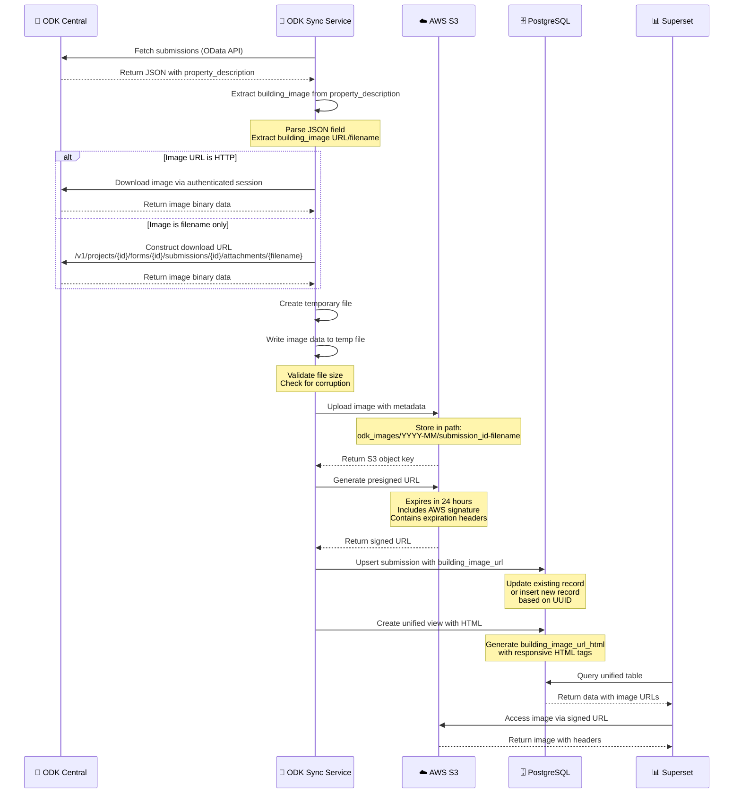
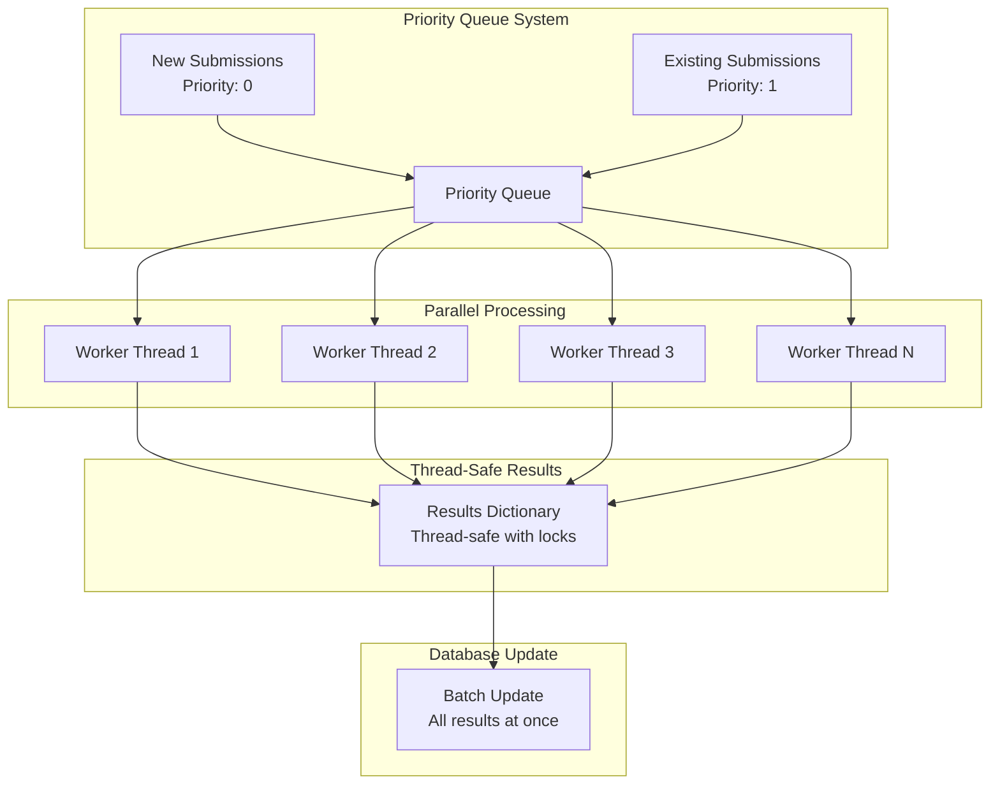
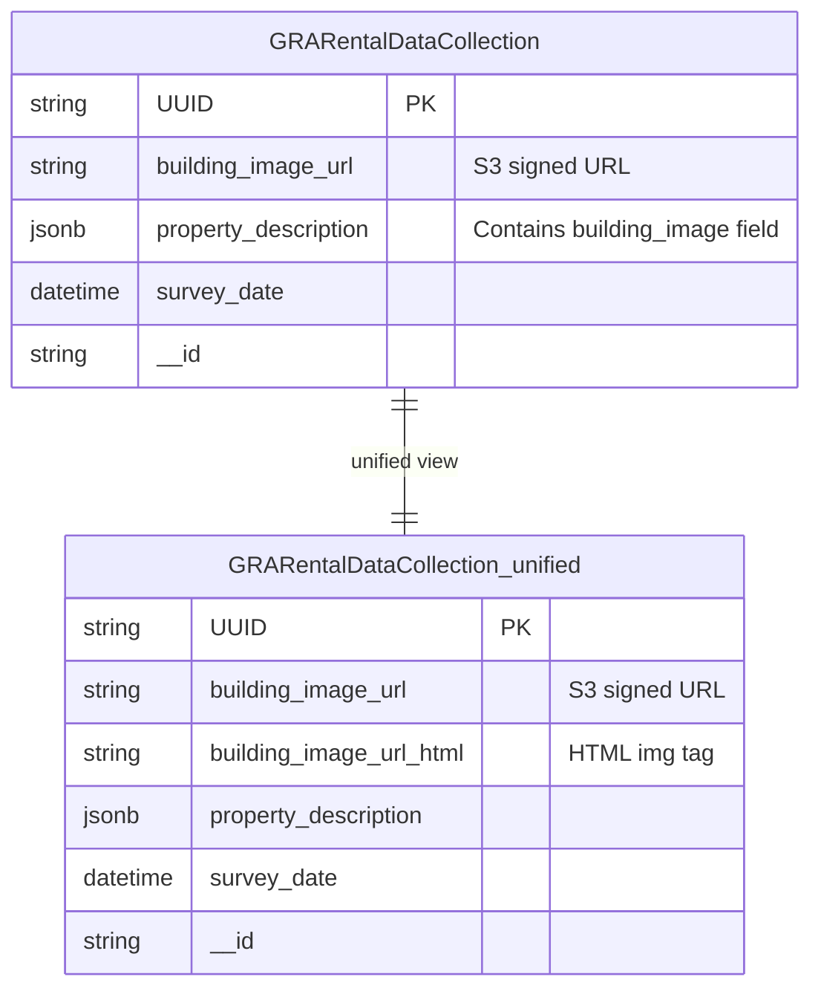
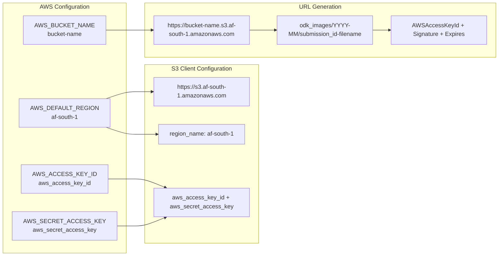
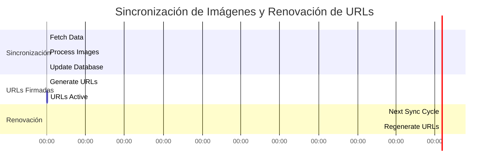

# Diagrama Detallado del Procesamiento de Imágenes

## 1. Flujo Completo de Procesamiento de Imágenes



## 2. Proceso Detallado de Autenticación y Descarga

```mermaid
flowchart TD
    START[Start Image Processing] --> CHECK_AUTH{Check ODK Session}
    
    CHECK_AUTH -->|Session exists| USE_SESSION[Use existing session]
    CHECK_AUTH -->|No session| CREATE_SESSION[Create new ODK session]
    
    CREATE_SESSION --> AUTH_REQUEST[POST /v1/sessions<br/>email + password]
    AUTH_REQUEST --> GET_TOKEN[Extract Bearer token]
    GET_TOKEN --> USE_SESSION
    
    USE_SESSION --> CHECK_URL{Image URL type?}
    
    CHECK_URL -->|HTTP URL| DIRECT_DOWNLOAD[Download directly]
    CHECK_URL -->|Filename only| CONSTRUCT_URL[Construct ODK URL]
    
    CONSTRUCT_URL --> BUILD_URL[Build download URL:<br/>/v1/projects/{id}/forms/{id}/<br/>submissions/{id}/attachments/{filename}]
    BUILD_URL --> DIRECT_DOWNLOAD
    
    DIRECT_DOWNLOAD --> DOWNLOAD[GET request with Bearer token]
    DOWNLOAD --> VALIDATE_RESPONSE{Response valid?}
    
    VALIDATE_RESPONSE -->|200 OK| SAVE_TEMP[Save to temp file]
    VALIDATE_RESPONSE -->|Error| LOG_ERROR[Log error and skip]
    
    SAVE_TEMP --> CHECK_SIZE{File size > 100 bytes?}
    CHECK_SIZE -->|Yes| UPLOAD_S3[Upload to S3]
    CHECK_SIZE -->|No| LOG_CORRUPT[Log as corrupted]
    
    UPLOAD_S3 --> GENERATE_SIGNED[Generate signed URL]
    GENERATE_SIGNED --> UPDATE_DB[Update database]
    
    LOG_ERROR --> NEXT_IMAGE[Process next image]
    LOG_CORRUPT --> NEXT_IMAGE
    UPDATE_DB --> NEXT_IMAGE
```

## 3. Generación de URLs Firmadas y Headers de Expiración

```mermaid
graph TB
    subgraph "AWS S3 Signed URL Generation"
        S3_CLIENT[boto3.client<br/>s3, region, credentials]
        UPLOAD[upload_to_s3<br/>file_data, s3_file_name]
        SIGNED_URL[generate_signed_url<br/>s3_key, expires=86400]
        
        S3_CLIENT --> UPLOAD
        UPLOAD --> SIGNED_URL
    end
    
    subgraph "URL Structure"
        BASE_URL[https://bucket-name.s3.region.amazonaws.com]
        OBJECT_KEY[odk_images/2024-01/submission_id-filename.jpg]
        SIGNATURE[Signature=abc123...]
        EXPIRES[Expires=1704067200]
        
        BASE_URL --> OBJECT_KEY
        OBJECT_KEY --> SIGNATURE
        SIGNATURE --> EXPIRES
    end
    
    subgraph "Headers in Response"
        CONTENT_TYPE[Content-Type: image/jpeg]
        CACHE_CONTROL[Cache-Control: max-age=86400]
        EXPIRES_HEADER[Expires: Thu, 01 Jan 2025 00:00:00 GMT]
        ACCESS_CONTROL[Access-Control-Allow-Origin: *]
        
        CONTENT_TYPE --> CACHE_CONTROL
        CACHE_CONTROL --> EXPIRES_HEADER
        EXPIRES_HEADER --> ACCESS_CONTROL
    end
    
    subgraph "URL Example"
        EXAMPLE[https://mybucket.s3.af-south-1.amazonaws.com/<br/>odk_images/2024-01/abc123-building.jpg?<br/>AWSAccessKeyId=AKIA...&<br/>Signature=abc123...&<br/>Expires=1704067200]
    end
```



## 4. Procesamiento Paralelo y Cola de Prioridades



## 5. Estructura de Datos de Imágenes en Base de Datos



## 6. Manejo de Errores y Placeholders

```mermaid
flowchart TD
    START[Process Image] --> EXTRACT[Extract building_image]
    
    EXTRACT --> CHECK_IMAGE{Image exists?}
    
    CHECK_IMAGE -->|Yes| DOWNLOAD[Download from ODK]
    CHECK_IMAGE -->|No| CREATE_PLACEHOLDER[Create placeholder image]
    
    DOWNLOAD --> CHECK_DOWNLOAD{Download successful?}
    CHECK_DOWNLOAD -->|Yes| UPLOAD_S3[Upload to S3]
    CHECK_DOWNLOAD -->|No| CREATE_PLACEHOLDER
    
    CREATE_PLACEHOLDER --> PLACEHOLDER_IMG[Generate placeholder:<br/>- Light gray background<br/>- "No Image Available" text<br/>- Submission ID<br/>- 300x200 pixels]
    
    PLACEHOLDER_IMG --> UPLOAD_PLACEHOLDER[Upload placeholder to S3]
    UPLOAD_S3 --> UPLOAD_PLACEHOLDER
    
    UPLOAD_PLACEHOLDER --> GENERATE_HTML[Generate HTML]
    
    GENERATE_HTML --> CHECK_TYPE{Is placeholder?}
    CHECK_TYPE -->|Yes| PLACEHOLDER_HTML[HTML with placeholder class]
    CHECK_TYPE -->|No| NORMAL_HTML[Standard responsive HTML]
    
    PLACEHOLDER_HTML --> UPDATE_DB[Update database]
    NORMAL_HTML --> UPDATE_DB
```

## 7. Configuración de AWS S3 y Credenciales



## 8. Intervalo de Sincronización y Renovación de URLs



## 9. Estructura de Archivos Temporales y Limpieza

```mermaid
graph TD
    subgraph "Temporary File Management"
        TEMP_FILE[tempfile.NamedTemporaryFile<br/>delete=False]
        DOWNLOAD[Download image data]
        WRITE[Write to temp file]
        UPLOAD[Upload to S3]
        CLEANUP[os.unlink temp_file.name]
        
        TEMP_FILE --> DOWNLOAD
        DOWNLOAD --> WRITE
        WRITE --> UPLOAD
        UPLOAD --> CLEANUP
    end
    
    subgraph "S3 File Organization"
        ROOT[odk_images/]
        YEAR_MONTH[2024-01/]
        SUBMISSION_FILES[submission_id-filename.jpg]
        
        ROOT --> YEAR_MONTH
        YEAR_MONTH --> SUBMISSION_FILES
    end
    
    subgraph "Placeholder Images"
        PLACEHOLDER_ROOT[placeholders/]
        PLACEHOLDER_FILES[submission_id.png]
        
        PLACEHOLDER_ROOT --> PLACEHOLDER_FILES
    end
```



## 10. Resumen del Proceso Completo

### 🔄 **Flujo de Procesamiento de Imágenes:**

1. **Extracción**: Parse `property_description` JSON para obtener `building_image`
2. **Autenticación**: Crear sesión ODK Central con Bearer token
3. **Descarga**: Descargar imagen desde ODK Central API
4. **Validación**: Verificar tamaño y integridad del archivo
5. **Almacenamiento**: Subir a AWS S3 con estructura organizada
6. **Firma**: Generar URL firmada con expiración de 24 horas
7. **Upsert**: Actualizar base de datos con URL de imagen
8. **Vista Unificada**: Crear HTML responsive para Superset

### 🚀 **Optimizaciones Implementadas:**

- **Procesamiento Paralelo**: Múltiples workers para subida de imágenes
- **Cola de Prioridades**: Nuevas imágenes se procesan primero
- **URLs Firmadas**: Acceso seguro con expiración automática
- **Placeholders**: Imágenes de respaldo cuando no hay imagen original
- **Limpieza Automática**: Eliminación de archivos temporales

### 📊 **Estructura de Datos:**

- **Tabla Principal**: `building_image_url` (URL firmada)
- **Vista Unificada**: `building_image_url_html` (HTML responsive)
- **Organización S3**: `odk_images/YYYY-MM/submission_id-filename`
- **Expiración**: URLs válidas por 24 horas, renovadas cada sincronización 