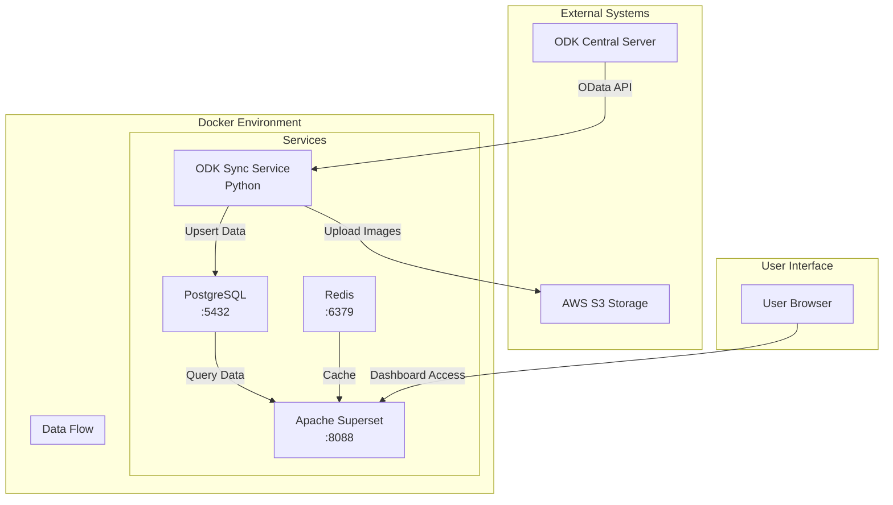
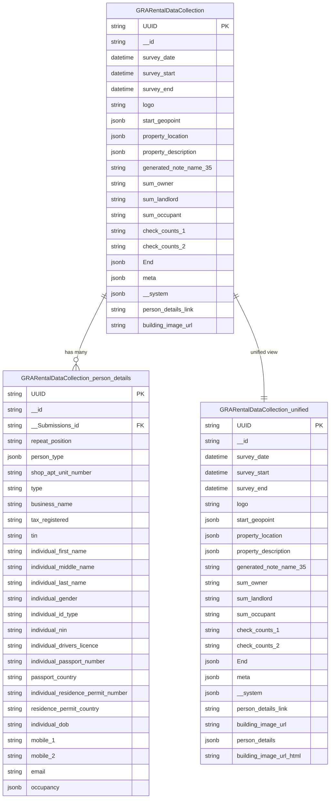
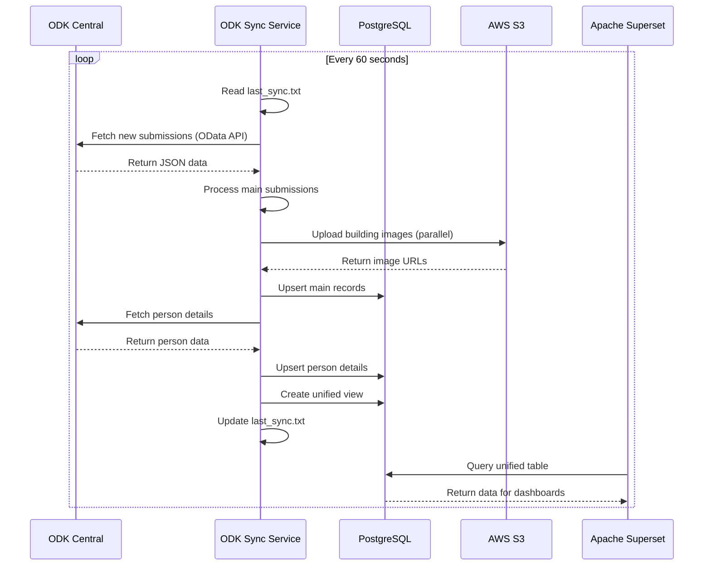
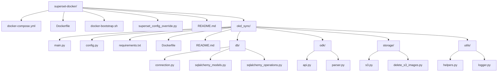
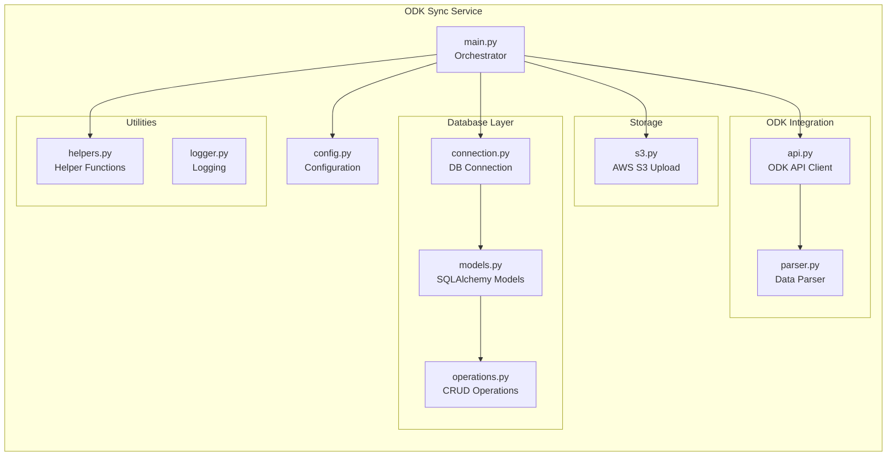
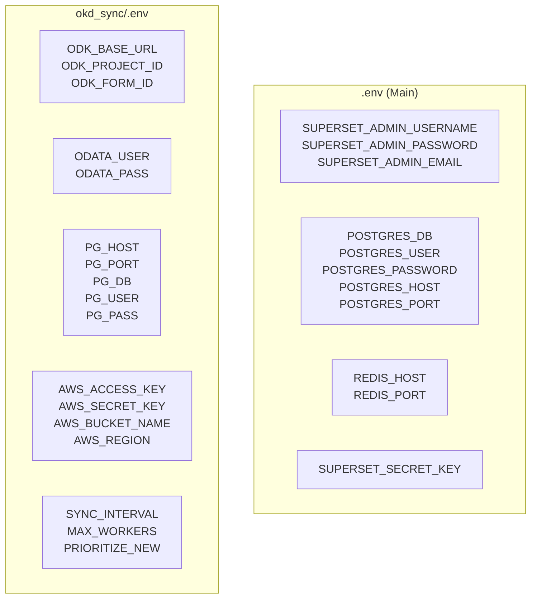
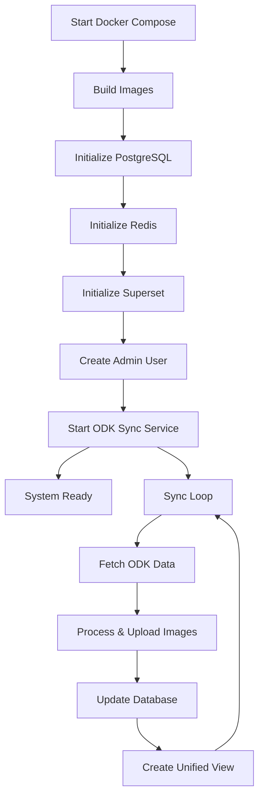
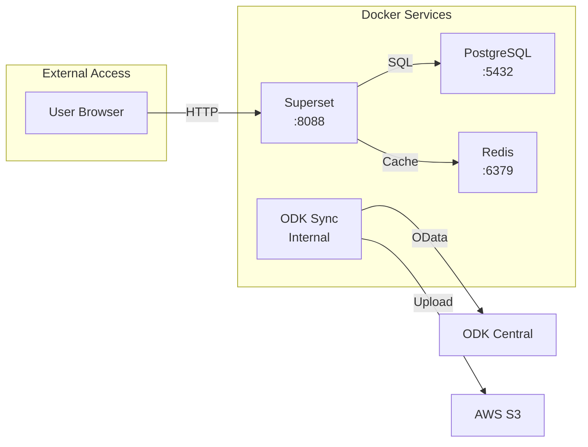

# Diagrama de Arquitectura del Proyecto Superset-Docker

## 1. Arquitectura General del Sistema

## 2. Estructura de Base de Datos

## 3. Flujo de Sincronización de Datos

## 4. Estructura de Archivos del Proyecto

## 5. Componentes del Servicio ODK Sync

## 6. Configuración de Variables de Entorno

## 7. Proceso de Inicialización

## 8. Puntos de Acceso y Puertos

## Resumen de la Arquitectura

### 🏗️ **Componentes Principales**
1. **Apache Superset** - Plataforma de visualización web
2. **PostgreSQL** - Base de datos principal
3. **Redis** - Cache y cola de tareas
4. **ODK Sync Service** - Servicio de sincronización Python

### 📊 **Estructura de Datos**
- **Tabla Principal**: `GRARentalDataCollection` - Datos de formularios
- **Tabla Detalles**: `GRARentalDataCollection_person_details` - Información de personas
- **Vista Unificada**: `GRARentalDataCollection_unified` - Vista combinada para Superset

### 🔄 **Flujo de Datos**
1. **ODK Central** → Datos de formularios móviles
2. **ODK Sync** → Sincronización cada 60 segundos
3. **PostgreSQL** → Almacenamiento estructurado
4. **Superset** → Dashboards y visualizaciones

### 🚀 **Características Clave**
- Sincronización automática cada 60 segundos
- Procesamiento paralelo de imágenes
- Upsert inteligente basado en UUID
- Vista unificada para consultas simples
- Subida automática de imágenes a S3 