# Sistema de Tracking de Sincronización y Verificación de Nuevas Submissions

## 1. Flujo Completo del Sistema de Tracking

```mermaid
sequenceDiagram
    participant Sync as 🔄 ODK Sync Service
    participant File as 📄 last_sync.txt
    participant ODK as 📱 ODK Central API
    participant DB as 🗄️ PostgreSQL
    
    %% Initialization
    Sync->>File: Read last_sync.txt
    alt File exists
        File-->>Sync: Return timestamp (ISO format)
        Sync->>Sync: Parse datetime from ISO string
    else File doesn't exist
        File-->>Sync: File not found
        Sync->>Sync: Set last_sync = None
    end
    
    %% API Call with Filter
    Sync->>ODK: GET /v1/projects/{id}/forms/{id}.svc/Submissions?<br/>$filter=SubmittedDate gt {last_sync}&<br/>$format=json&$count=true
    ODK-->>Sync: Return only new submissions since last_sync
    
    %% Process New Submissions
    alt New submissions found
        Sync->>Sync: Process submissions (parse, validate)
        Sync->>DB: Upsert new records (UUID-based)
        Sync->>Sync: Find latest timestamp from processed records
        Sync->>File: Write new timestamp to last_sync.txt
    else No new submissions
        Sync->>Sync: Log "No new submissions found"
    end
    
    %% Loop continues
    Sync->>Sync: Sleep for SYNC_INTERVAL (60s)
    Sync->>File: Read last_sync.txt (next cycle)
```



## 2. Estructura del Archivo last_sync.txt

```mermaid
graph TD
    subgraph "File: last_sync.txt"
        CONTENT[2024-01-15T14:30:25.123456+00:00]
    end
    
    subgraph "File Location"
        PATH[okd_sync/last_sync.txt]
    end
    
    subgraph "File Operations"
        READ[get_last_sync_time()<br/>Read and parse ISO timestamp]
        WRITE[set_last_sync_time()<br/>Write ISO timestamp]
    end
    
    CONTENT --> READ
    READ --> WRITE
    WRITE --> CONTENT
```

## 3. Proceso de Filtrado Incremental en ODK Central

```mermaid
flowchart TD
    START[Start Sync Cycle] --> READ_TIMESTAMP[Read last_sync.txt]
    
    READ_TIMESTAMP --> CHECK_TIMESTAMP{Timestamp exists?}
    
    CHECK_TIMESTAMP -->|Yes| FORMAT_FILTER[Format for OData filter<br/>YYYY-MM-DDTHH:MM:SS.ffffffZ]
    CHECK_TIMESTAMP -->|No| NO_FILTER[No filter - get all submissions]
    
    FORMAT_FILTER --> BUILD_URL[Build OData URL with filter:<br/>$filter=SubmittedDate gt {timestamp}]
    NO_FILTER --> BUILD_URL_NO_FILTER[Build OData URL without filter]
    
    BUILD_URL --> API_CALL[GET request to ODK Central]
    BUILD_URL_NO_FILTER --> API_CALL
    
    API_CALL --> PARSE_RESPONSE[Parse JSON response]
    PARSE_RESPONSE --> PROCESS_RECORDS[Process each record]
    
    PROCESS_RECORDS --> UPDATE_TIMESTAMP[Find latest SubmittedDate]
    UPDATE_TIMESTAMP --> WRITE_FILE[Write to last_sync.txt]
    
    WRITE_FILE --> NEXT_CYCLE[Wait for next cycle]
```

## 4. Código Detallado del Proceso de Tracking

```mermaid
graph TB
    subgraph "Helper Functions (utils/helpers.py)"
        GET_LAST[get_last_sync_time()<br/>Read from last_sync.txt]
        SET_LAST[set_last_sync_time(ts)<br/>Write to last_sync.txt]
    end
    
    subgraph "API Functions (odk/api.py)"
        FETCH_ODATA[fetch_odata(url, last_sync, filter_field)]
        FETCH_MAIN[fetch_main_submissions(last_sync)]
        FETCH_PERSON[fetch_person_details(last_sync)]
    end
    
    subgraph "Main Process (main.py)"
        MAIN_FUNC[main() function]
        UPDATE_TS[Update last sync time]
    end
    
    GET_LAST --> FETCH_MAIN
    FETCH_MAIN --> FETCH_ODATA
    FETCH_ODATA --> MAIN_FUNC
    MAIN_FUNC --> UPDATE_TS
    UPDATE_TS --> SET_LAST
```

## 5. Ejemplo de URL de Filtrado OData


## 6. Manejo de Errores en el Tracking

```mermaid
flowchart TD
    START[Read last_sync.txt] --> CHECK_FILE{File exists?}
    
    CHECK_FILE -->|Yes| READ_CONTENT[Read file content]
    CHECK_FILE -->|No| RETURN_NONE[Return None]
    
    READ_CONTENT --> CHECK_CONTENT{Content valid?}
    CHECK_CONTENT -->|Yes| PARSE_ISO[Parse ISO timestamp]
    CHECK_CONTENT -->|No| LOG_ERROR[Log error and return None]
    
    PARSE_ISO --> CHECK_PARSE{Parse successful?}
    CHECK_PARSE -->|Yes| RETURN_DATETIME[Return datetime object]
    CHECK_PARSE -->|No| LOG_PARSE_ERROR[Log parse error and return None]
    
    RETURN_NONE --> CONTINUE[Continue with None (get all records)]
    LOG_ERROR --> CONTINUE
    LOG_PARSE_ERROR --> CONTINUE
    RETURN_DATETIME --> CONTINUE
```

## 7. Proceso de Actualización del Timestamp


## 8. Comparación: Sincronización Incremental vs Completa


## 9. Estructura de Datos del Tracking


## 10. Configuración del Intervalo de Sincronización

```mermaid
graph TD
    subgraph "Environment Configuration"
        SYNC_INTERVAL[SYNC_INTERVAL=60<br/>Default: 60 seconds]
    end
    
    subgraph "Main Loop (main.py)"
        WHILE_LOOP[while True:]
        SLEEP[sleep(SYNC_INTERVAL)]
        MAIN_CALL[main()]
        
        WHILE_LOOP --> MAIN_CALL
        MAIN_CALL --> SLEEP
        SLEEP --> WHILE_LOOP
    end
    
    subgraph "Timing Control"
        LAST_RUN[Track last_run_time]
        CHECK_LONG[Check if previous run too long]
        WARNING[Log warning if > 2x interval]
        
        LAST_RUN --> CHECK_LONG
        CHECK_LONG --> WARNING
    end
    
    SYNC_INTERVAL --> SLEEP
    SYNC_INTERVAL --> CHECK_LONG
```

## 11. Resumen del Sistema de Tracking

### 🔄 **Proceso de Sincronización Incremental:**

1. **Lectura del Timestamp**: Lee `last_sync.txt` para obtener la última sincronización
2. **Filtrado OData**: Construye URL con filtro `SubmittedDate gt {timestamp}`
3. **Fetch Incremental**: Solo obtiene submissions nuevas desde el último sync
4. **Procesamiento**: Procesa únicamente los registros nuevos
5. **Upsert Inteligente**: Actualiza o inserta basado en UUID
6. **Actualización Timestamp**: Encuentra el timestamp más reciente y lo guarda

### 📁 **Archivo de Tracking:**
- **Ubicación**: `okd_sync/last_sync.txt`
- **Formato**: ISO timestamp (ej: `2024-01-15T14:30:25.123456+00:00`)
- **Operaciones**: Lectura/escritura con manejo de errores

### 🚀 **Ventajas del Sistema:**

- **Eficiencia**: Solo procesa datos nuevos
- **Rendimiento**: Reduce tiempo de procesamiento
- **Escalabilidad**: Funciona bien con grandes volúmenes
- **Robustez**: Manejo de errores en lectura/escritura
- **Configurabilidad**: Intervalo ajustable via environment

### 🔧 **Configuración:**
- **Intervalo**: `SYNC_INTERVAL=60` (segundos)
- **Workers**: `MAX_WORKERS=10` (procesamiento paralelo)
- **Prioridad**: `PRIORITIZE_NEW=true` (nuevos primero)

### 📊 **Ejemplo de Flujo:**
```
Ciclo 1: last_sync.txt = null → Obtiene todas las submissions
Ciclo 2: last_sync.txt = 2024-01-15T14:30:25Z → Solo submissions después de esa fecha
Ciclo 3: last_sync.txt = 2024-01-15T14:31:25Z → Solo submissions después de esa fecha
```

Este sistema garantiza que **solo se procesen las submissions nuevas** en cada ciclo, optimizando significativamente el rendimiento y evitando reprocesamiento innecesario. 