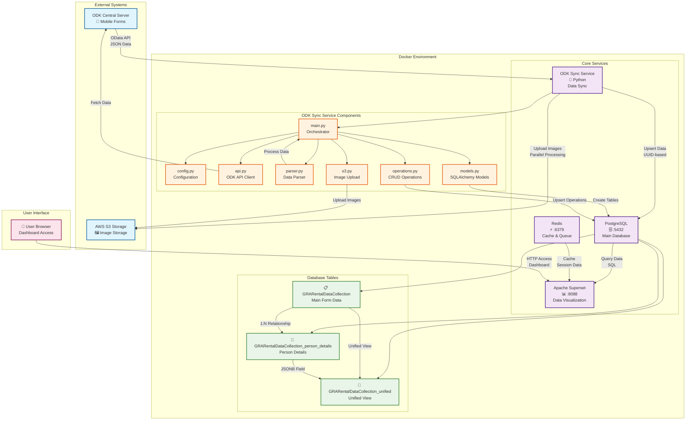
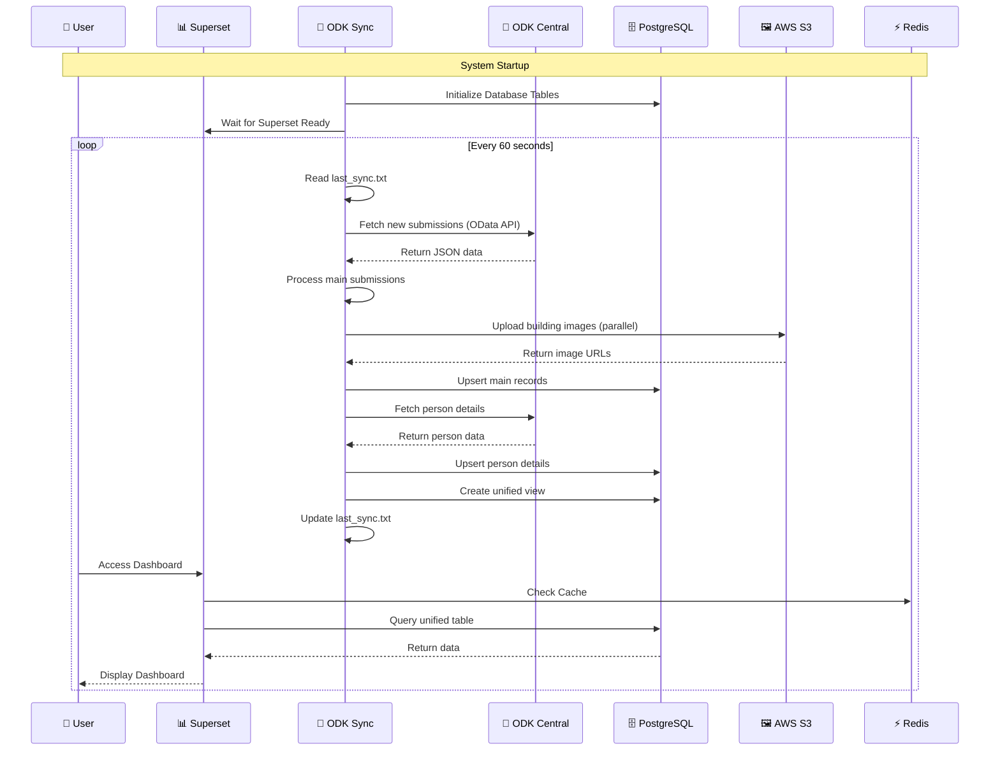
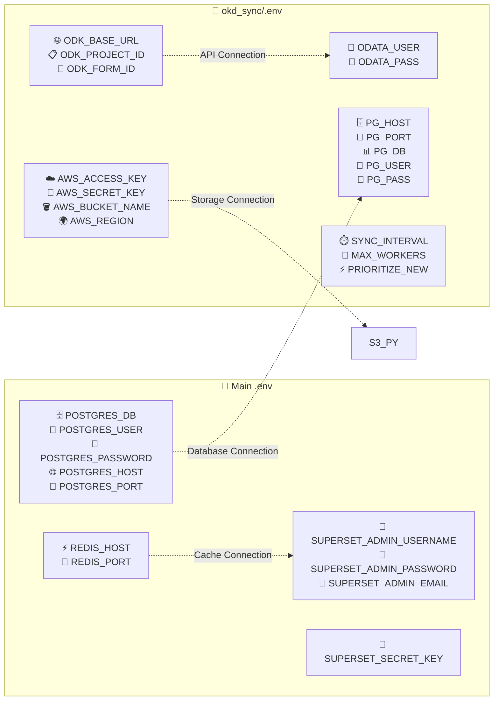
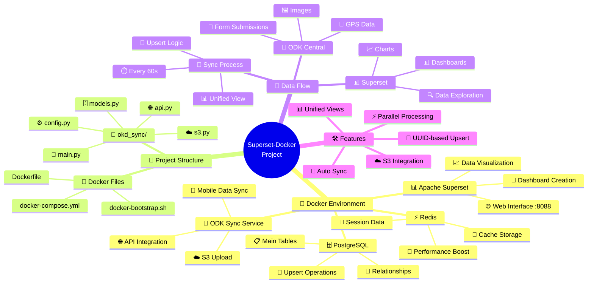

# Diagrama Unificado del Proyecto Superset-Docker

## Vista Completa del Sistema

## Flujo de Datos Detallado

## Estructura de Archivos Integrada

```mermaid
graph TD
    ROOT[📁 superset-docker/]
    
    %% Main Project Files
    ROOT --> DOCKER[docker-compose.yml<br/>🐳 Services Config]
    ROOT --> DOCKERFILE[Dockerfile<br/>🐳 Superset Image]
    ROOT --> BOOTSTRAP[docker-bootstrap.sh<br/>🚀 Init Script]
    ROOT --> CONFIG[superset_config_override.py<br/>⚙️ Superset Config]
    ROOT --> README[README.md<br/>📖 Documentation]
    
    %% ODK Sync Service
    ROOT --> ODK_SYNC[📁 okd_sync/]
    
    ODK_SYNC --> MAIN[main.py<br/>🎯 Main Orchestrator]
    ODK_SYNC --> CONFIG_PY[config.py<br/>⚙️ Configuration]
    ODK_SYNC --> REQUIREMENTS[requirements.txt<br/>📦 Dependencies]
    ODK_SYNC --> DOCKERFILE_SYNC[Dockerfile<br/>🐳 Sync Image]
    ODK_SYNC --> README_SYNC[README.md<br/>📖 Sync Docs]
    
    %% Database Layer
    ODK_SYNC --> DB[📁 db/]
    DB --> CONNECTION[connection.py<br/>🔌 DB Connection]
    DB --> MODELS[sqlalchemy_models.py<br/>🗄️ Data Models]
    DB --> OPERATIONS[sqlalchemy_operations.py<br/>🔄 CRUD Operations]
    
    %% ODK Integration
    ODK_SYNC --> ODK[📁 odk/]
    ODK --> API[api.py<br/>🌐 ODK API Client]
    ODK --> PARSER[parser.py<br/>🔍 Data Parser]
    
    %% Storage Layer
    ODK_SYNC --> STORAGE[📁 storage/]
    STORAGE --> S3[s3.py<br/>☁️ AWS S3 Upload]
    STORAGE --> DELETE[delete_s3_images.py<br/>🗑️ S3 Cleanup]
    
    %% Utilities
    ODK_SYNC --> UTILS[📁 utils/]
    UTILS --> HELPERS[helpers.py<br/>🛠️ Helper Functions]
    UTILS --> LOGGER[logger.py<br/>📝 Logging]
    
    %% Environment Files
    ROOT --> ENV_MAIN[.env<br/>🔐 Main Config]
    ODK_SYNC --> ENV_SYNC[okd_sync/.env<br/>🔐 Sync Config]
    
    %% Styling
    classDef root fill:#e3f2fd,stroke:#1565c0,stroke-width:2px
    classDef file fill:#f3e5f5,stroke:#7b1fa2,stroke-width:2px
    classDef folder fill:#e8f5e8,stroke:#388e3c,stroke-width:2px
    classDef config fill:#fff3e0,stroke:#f57c00,stroke-width:2px
    
    class ROOT root
    class DOCKER,DOCKERFILE,BOOTSTRAP,CONFIG,README,MAIN,CONFIG_PY,REQUIREMENTS,DOCKERFILE_SYNC,README_SYNC,CONNECTION,MODELS,OPERATIONS,API,PARSER,S3,DELETE,HELPERS,LOGGER file
    class ODK_SYNC,DB,ODK,STORAGE,UTILS folder
    class ENV_MAIN,ENV_SYNC config
```

## Configuración de Variables de Entorno

## Resumen Visual del Sistema

## Características Técnicas Destacadas

### 🔄 **Sincronización Automática**
- **Intervalo**: Cada 60 segundos
- **Método**: OData API de ODK Central
- **Estrategia**: Upsert basado en UUID
- **Procesamiento**: Paralelo para imágenes

### 🗄️ **Estructura de Base de Datos**
- **Tabla Principal**: `GRARentalDataCollection` (datos de formularios)
- **Tabla Detalles**: `GRARentalDataCollection_person_details` (información de personas)
- **Vista Unificada**: `GRARentalDataCollection_unified` (vista combinada)

### 🐳 **Arquitectura Docker**
- **4 Servicios**: Superset, PostgreSQL, Redis, ODK Sync
- **Red Interna**: Comunicación entre contenedores
- **Persistencia**: Volúmenes para datos
- **Health Checks**: Monitoreo de servicios

### 🚀 **Optimizaciones**
- **Cache Redis**: Mejora rendimiento de Superset
- **Procesamiento Paralelo**: Subida de imágenes a S3
- **Upsert Inteligente**: Evita duplicados
- **Vista Unificada**: Consultas simples en Superset

### 📊 **Casos de Uso**
- **Recopilación de Datos**: Formularios móviles con ODK
- **Visualización**: Dashboards en tiempo real
- **Análisis**: Exploración de datos con Superset
- **Almacenamiento**: Imágenes en AWS S3 